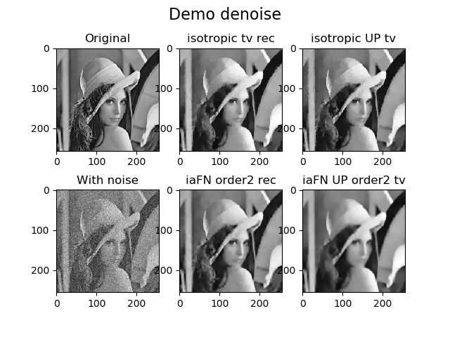
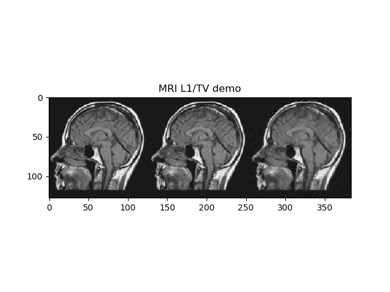
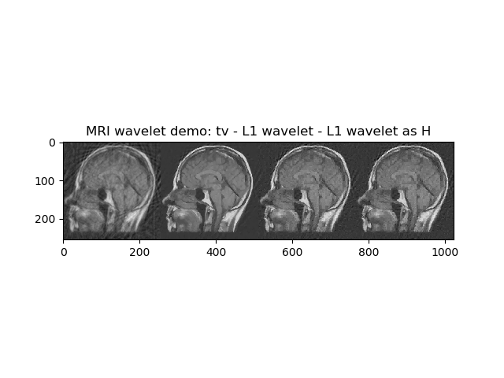

# IAFNNA: Isotropic and Anisotropic Filtering Norm NESTerov Algorithm
A python implementation of Filtering norm with NESTA Implementation of the Isotropic and Anisotropic Filtering Norm minimization, from the paper: <https://www.researchgate.net/profile/Mylene_Farias/publication/340769023_Isotropic_and_anisotropic_filtering_norm-minimization_A_generalization_of_the_TV_and_TGV_minimizations_using_NESTA/links/5ea703c345851553fab34738/Isotropic-and-anisotropic-filtering-norm-minimization-A-generalization-of-the-TV-and-TGV-minimizations-using-NESTA.pdf>

Based on the Matlab code of NESTA: https://statweb.stanford.edu/~candes/software/nesta/ If the use of this code generate paper, please, cite both papers:
```
@article{lima2020isotropic, 
title={Isotropic and anisotropic filtering norm-minimization: A generalization of the TV and TGV minimizations using NESTA}, 
author={Lima, Jonathan A and da Silva, Felipe B and von Borries, Ricardo and Miosso, Cristiano J and Farias, Myl{`e}ne CQ}, 
journal={Signal Processing: Image Communication}, pages={115856}, year={2020}, publisher={Elsevier} }
```
```
@article{becker2011nesta, title={NESTA: A fast and accurate first-order method for sparse recovery}, 
author={Becker, Stephen and Bobin, J{'e}r{^o}me and Cand{`e}s, Emmanuel J}, 
journal={SIAM Journal on Imaging Sciences}, 
volume={4}, number={1}, pages={1--39}, year={2011}, publisher={SIAM} }
```
We build this version over the NESTA_v1.1 implementation (https://statweb.stanford.edu/~candes/software/nesta/NESTA_v1.1.zip). Refered as IAFNNESTA.

The IAFNNESTA.m:
Solves the filtering norm L1 and/or L2 minimization problem under a quadratic constraint using the Nesterov algorithm, with continuation:

%20s.t.%20||y%20-%20Ax||_2%20\leq%20\delta)

Continuation is performed by sequentially applying Nesterov's algorithm with a decreasing sequence of values of mu0 >= mu >= muf. This version adds the following features: *Isotropic and anisotropic norms *Filtering norms *A demo for isotropic and anisotropic filtering norms for MRI radial reconstruction.

For more details, see the IAFNNESTA.m, IAFNNesterov.m files.

New:
I also included the unconstrained problem:

%20+%201/2%20||y%20-%20Ax||_2%20)
For more details, see the IAFNNESTA\_UP.m, IAFNNesterov\_UP.m files.

## Demos:
I prepared some demos for showing how to use it in useful applications

#### Denoising:
run the file `demo_denoise.py`


#### MRI L1/TV and filtering norms reconstruction with IAFNNESTA (simulates the reconstruction on the paper):
run `demo_mri_reconstruction.py`



#### Tomographic L1/TV and filtering norms reconstruction with unconstrained problem (IAFNNESTA_UP):
run `demo_tomography.py`


#### Reconstruction with an sparse transform (Wavelet):
run `demo_wavelet.py`



-
Created: Jul 2020, Jonathan Lima, UnB
Modification: Fev 2020
